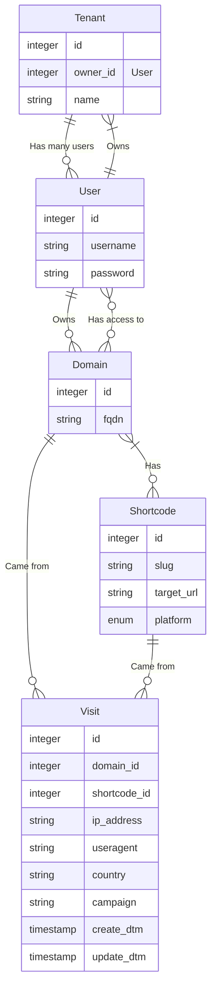

# Corto - Shorten all the Links 🔗

Corto is a modern and flexible link shortener written in Go.

## Features

- One short code multiple domains
- Click tracking
- Campaign tracking
- Device specific links
- Location statistics
- Add short link via API
- Nice WebIU

## Datamodel

