# Corto - Shorten all the Links 🔗


A modern, multi-tenant link shortener written in Go. One short code can live on many domains, every click is tracked, and the whole thing ships as a single self-contained binary with an embedded web UI.

## Features

- **Multi-domain short codes** — one link can be served on several domains at once, with per-domain click stats
- **Multi-tenant** — users belong to one or more tenants and switch between them in the UI; all data is tenant-scoped
- **Click tracking** — totals, last-7-days, per-domain, per-campaign (`utm_campaign`), and per-country breakdowns
- **GeoIP country stats** — resolve visitor countries with a MaxMind-format database (GeoLite2 or DB-IP), painted on a world map
- **Generated slugs** — leave the slug empty and get a random 7-character base62 code, bit.ly style
- **Link lifecycle** — validity windows (`valid_since`/`valid_until`), visit limits (`max_visits`), and fallback URLs at link and domain level
- **Device-specific redirects** — platform targets (iOS, Android, macOS, Windows, Linux, Mobile, Desktop) by User-Agent
- **Query forwarding** — optionally pass the incoming query string through to the target
- **Colored tags** — organize links with tags carrying a color and description
- **Web UI** — embedded Svelte admin at `/admin` with a stats dashboard, world map, and full link/domain/tag management
- **REST API** — everything the UI does, documented via OpenAPI at `/docs`
- **Shlink import** — migrate links, tags, domains, visit history, and visit limits from a [Shlink](https://shlink.io) instance
- **Single binary** — web UI and SQL migrations are embedded; deploy the binary or the distroless Docker image

## Installation

### From source

Requires Go 1.22+ and Node 22+ (for the web UI).

```sh
git clone https://github.com/davidolrik/corto.git
cd corto
npm --prefix web ci && npm --prefix web run build
go build -o corto .
```

### Docker

```sh
docker pull ghcr.io/davidolrik/corto:latest
```

## Quick Start

Corto needs PostgreSQL. Point it at your database (see [Configuration](#configuration)), then:

```sh
# Apply database migrations
corto migration up

# Bootstrap a user and a tenant
corto user create alice
corto tenant create "Acme Links" --owner alice

# Start the server
corto server
```

Open `http://localhost:3000/admin/`, log in as `alice`, create a domain (e.g. `go.example.com`) and your first link. Point the domain's DNS at corto, and `https://go.example.com/your-slug` redirects — tracking every click.

### Docker Compose

```yaml
services:
  corto:
    image: ghcr.io/davidolrik/corto:latest
    ports:
      - "3000:3000"
    environment:
      - CORTO_DATABASE_HOST=db
      - CORTO_DATABASE_USERNAME=corto
      - CORTO_DATABASE_PASSWORD=corto
      - CORTO_DATABASE_SCHEMA=corto
      - CORTO_SERVER_PRIVATE_KEY=… # paseto v4 secret key (hex)
      - CORTO_SERVER_PUBLIC_KEY=…  # paseto v4 public key (hex)
    depends_on:
      - db
  db:
    image: postgres:17
    environment:
      - POSTGRES_USER=corto
      - POSTGRES_PASSWORD=corto
      - POSTGRES_DB=corto
    volumes:
      - ./data:/var/lib/postgresql/data
```

Run migrations with `docker compose run corto migration up`.

## Configuration

Configuration is resolved in precedence order: **defaults < `/etc/corto/config.toml` < `~/.config/corto/config.toml` < environment < CLI flags**. Environment variables are prefixed with `CORTO_` and use underscores for section separators (`server.port` → `CORTO_SERVER_PORT`).

| Key               | Default     | Description                                                            |
| ----------------- | ----------- | ---------------------------------------------------------------------- |
| `server.ip`       | `127.0.0.1` | Address to bind (the Docker image sets `0.0.0.0`)                       |
| `server.port`     | `3000`      | Port to listen on                                                       |
| `server.private_key` | random   | PASETO v4 secret key (hex) used to sign tokens                          |
| `server.public_key`  | random   | PASETO v4 public key (hex) used to verify tokens                        |
| `database.host`   | `127.0.0.1` | PostgreSQL host                                                         |
| `database.port`   | `5432`      | PostgreSQL port                                                         |
| `database.schema` | `corto`     | Database name                                                           |
| `database.username` | `corto`   | Database user                                                           |
| `database.password` | `corto`   | Database password                                                       |
| `geoip.database`  | _empty_     | Path to a MaxMind-format country database; empty disables GeoIP lookups |
| `log.force_stdout` | `false`    | Force JSON logs to stdout even on a terminal                            |

The default PASETO keys are randomly generated per start and only useful for testing — set fixed keys for any real deployment, or sessions break on restart.

Write the resolved config to disk with `corto config write`, inspect it with `corto config show`.

### GeoIP

Country stats need a MaxMind-format database: either [GeoLite2-Country](https://dev.maxmind.com/geoip/geolite2-free-geolocation-data/) (free MaxMind account) kept fresh with `geoipupdate`, or the no-signup [DB-IP country lite](https://db-ip.com/db/download/ip-to-country-lite). Visits without a resolvable country are bucketed as `unknown`.

```toml
[geoip]
database = "/opt/homebrew/var/GeoIP/GeoLite2-Country.mmdb"
```

## Commands

### `corto server`

Starts the redirect server, REST API, and embedded admin UI.

### `corto migration up` / `corto migration down`

Applies or reverts database migrations. Migrations are embedded in the binary and run from anywhere.

### `corto user create <username>`

Creates a user. The password is prompted (hidden), read from stdin when piped, or passed with `--password`.

```sh
corto user create alice
echo "$PASSWORD" | corto user create bot
```

### `corto tenant create <name> --owner <username>`

Creates a tenant owned by a user, granting the owner admin access. The URL slug is derived from the name, or set with `--slug`.

```sh
corto tenant create "Acme Links" --owner alice          # slug: acme-links
corto tenant create "Acme Links" --owner alice --slug acme
```

### `corto import shlink`

Imports short links from a [Shlink](https://shlink.io) instance via its REST API. Domains and tags are created as needed; the same Shlink code on several domains becomes one corto link spanning those domains; slugs already taken with a different target are skipped. Validity windows and visit limits carry over.

```sh
corto import shlink \
  --base-url https://s.example.com \
  --api-key YOUR_KEY \
  --tenant acme-links \
  --with-visits
```

Imports are idempotent: re-running changes nothing, and the visit history can be imported in a later run. Links on Shlink's default domain keep that domain's name, detected via the Shlink API — only links that exist in Shlink are created.

| Flag            | Description                                                              |
| --------------- | ------------------------------------------------------------------------ |
| `--base-url`    | Shlink instance URL                                                      |
| `--api-key`     | Shlink API key                                                           |
| `--tenant`      | Corto tenant slug to import into                                         |
| `--with-visits` | Also import the visit history (dates, referers, user agents, countries) |

### `corto config show` / `corto config write`

Shows the resolved configuration, or writes it to the config file.

### `corto --version`

Prints the version and exits.

## Web UI

The admin UI is served at `/admin/` and is embedded in the binary — no separate deployment.

- **Dashboard** — tenant-wide stats (links, domains, tags, clicks total and this week) and a world map heatmap of clicks by country
- **Links** — create and edit links in a modal; click a row to expand it into a per-link world map with domain, campaign, and country breakdowns; domain pills copy that domain's URL to the clipboard
- **Domains** and **Tags** — full management, tags with color and description
- **Tenant switcher** — the active tenant sits next to your username in the top bar; with access to more than one tenant it becomes a dropdown
- **Profile** — change your password

## API

The REST API lives under `/api` and is documented via OpenAPI at `/docs`. Authentication uses PASETO v4 tokens:

```sh
# Log in (the token is bound to your active tenant)
TOKEN=$(curl -s -X POST http://localhost:3000/api/auth/login \
  -H 'Content-Type: application/json' \
  -d '{"username":"alice","password":"…"}' | jq -r .token)

# Create a link; omit the slug to get a generated one
curl -s -X POST http://localhost:3000/api/short-codes \
  -H "Authorization: Bearer $TOKEN" \
  -H 'Content-Type: application/json' \
  -d '{"target_url":"https://example.com","domains":["go.example.com"],"max_visits":100}'

# Switch the active tenant (mints a fresh token)
curl -s -X POST http://localhost:3000/api/auth/tenant \
  -H "Authorization: Bearer $TOKEN" \
  -H 'Content-Type: application/json' \
  -d '{"tenant":"other-tenant"}'
```

Everything outside `/api` is public: short link redirects, the admin UI shell, `/docs`, and `/api/auth/login` + `/api/version`.

## How Redirects Work

A request like `GET /promo` with `Host: go.example.com` resolves the domain, then the slug on that domain (slugs are unique per domain, enforced by the database):

1. **Platform match** — if the link has platform-specific targets, the visitor's User-Agent picks the most specific one (iOS before Mobile, Android before Linux)
2. **Validity and limits** — outside the `valid_since`/`valid_until` window, or with `max_visits` reached, the fallback chain applies: platform fallback → link fallback → domain fallback → 404
3. **Query forwarding** — with `forward_query`, the incoming query string is merged into the target URL
4. **Tracking** — every redirect records a visit: IP (honoring `X-Forwarded-For`), user agent, referer, campaign (`utm_campaign`), and country (when GeoIP is configured). A failed visit write never blocks the redirect.

Unknown slugs on a known domain redirect to the domain's fallback URL when set. Redirects use `302 Found` so clicks keep being counted.

## Data Model

```mermaid
erDiagram

User ||--|{ Tenant : "owns"
Tenant ||--o{ User : "has members"
Tenant ||--o{ Domain : "has"
Tenant ||--o{ Tag : "has"
Domain ||--o{ ShortURL : "serves"
ShortCode ||--|{ ShortURL : "is served as"
ShortCode }o--o{ Tag : "is tagged"
ShortCode ||--o{ PlatformSpecificURL : "has"
ShortURL ||--o{ Visit : "received"

Tenant {
  string slug
  string name
}

Domain {
  string fqdn
  string fallback_url
  string description
}

ShortCode {
  string slug
  string title
  string description
  string target_url
  string fallback_url
  bool is_crawlable
  bool forward_query
  timestamp valid_since
  timestamp valid_until
  integer max_visits
}

ShortURL {
  string slug "unique per domain"
}

Visit {
  string ip_address
  string user_agent
  string referer
  string country
  string campaign
}

Tag {
  string slug
  string color
  string description
}
```



## Development

```sh
# Go tests (handler, middleware, and integration tests against the dev database)
go test ./...

# Frontend tests
cd web && npm test

# UI dev server with API proxy to a locally running corto
cd web && npm run dev
```

Service-layer tests are integration tests against a local PostgreSQL (`corto`/`corto` on `127.0.0.1:5432`) and skip when it is unreachable. Migrations are managed with [goose](https://github.com/pressly/goose); see `CLAUDE.md` for the development workflow.

## Releases

Releases are built with [goreleaser](https://goreleaser.com) on version tags (`0.1.0` style): binaries for Linux and macOS on amd64/arm64, plus a multi-arch distroless Docker image at `ghcr.io/davidolrik/corto`.

```sh
# Local snapshot build
goreleaser release --snapshot --clean --skip=publish
```

## License

MIT
